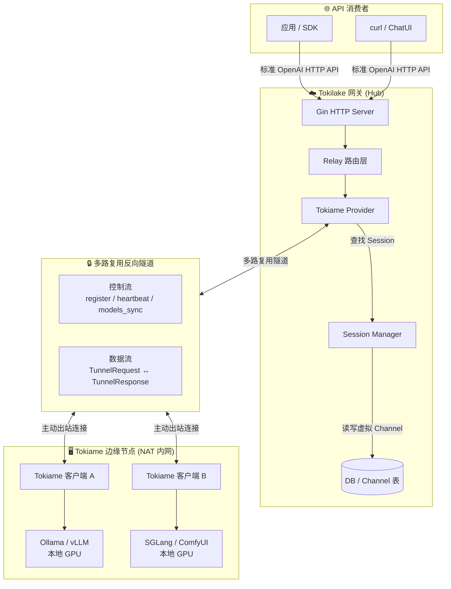

<p align="right">
   <strong>中文</strong> | <a href="./README.md">English</a>
</p>

# Tokilake & Tokiame

> **Control your own GPUs like OpenRouter.**

Tokilake 是基于 One-API 生态构建的去中心化大模型 API 调度网关。它彻底翻转了传统的 API 网关模型：不再局限于网关主动请求有公网 IP 的服务器，而是**允许任意位于 NAT/内网之后的 GPU 工作节点（Tokiame）通过反向隧道（WebSocket 或 QUIC）主动接入中心网关（Hub）**。

> **Tokilake** 基于 [MartialBE/one-hub](https://github.com/MartialBE/one-hub) 以及后续的 One-API 生态分支持续演进而来。

## 📖 快速开始 / Quick Start

你可以通过 [Tokilake Demo](https://tokilake.abrdns.com/) 快速体验核心功能。为了确保数据的绝对安全与分发的完全自主，我们强烈建议你参考**端到端部署指南**自行托管。无论你是初次体验还是准备深度部署，下方的文档都将为你提供完整指引。

- **[📚 中文使用指南](./docs/guide.zh.md)**
- **[📖 User Guide (English)](./docs/guide.en.md)**
- **[🖼️ 图像生成指南](./docs/ImageGen.zh.md)**
- **[🖼️ Image Generation Guide](./docs/ImageGen.md)**

## 🚀 一键部署 (推荐)

最快部署自带自动 HTTPS 和 QUIC 支持的 Tokilake Hub 的方法：

```bash
# 1. 克隆仓库
git clone https://github.com/Tokimorphling/Tokilake.git
cd Tokilake/deploy

# 2. 配置环境变量
cp .env.example .env
# 编辑 .env 文件，设置你的域名 (DOMAIN) 和 密钥 (SECRETS)

# 3. 启动
docker compose -f docker-compose.hub.yml up -d
```
部署完成后，即可通过 `https://your-domain` 访问你的管理后台。

## 🌟 核心理念

传统的 API 代理通常作为 Client，将请求路由到拥有公网 IP 地址的 Server。如果你的高算力显卡（如 RTX 4090）躺在家里的局域网内，或者散布在不同云厂商的临时竞价实例（Spot Instances）上，将其统一成稳定可用的 API 极具挑战。

**Tokiame** 改变了这一切。它作为一个轻量级守护进程，主动“拨号”连接到云端的 **Tokilake** 网关。连接成功后，Tokilake 会在系统内部将其无缝映射为一个标准的 `Channel`（渠道）。这意味着，**你无需任何内网穿透工具（如 FRP/Ngrok），就可以享受网关自带的企业级负载均衡、高并发削峰、鉴权与计费链路。**

## 🚀 完美适配的场景

### 1. 个人与工作室的分布式 GPU 池化（穿透 NAT）
针对只有内网 IP 的家庭宽带或校园网环境。只需在本地运行 Tokiame 进程，立刻与云端网关打通隧道。你本地使用 Ollama / vLLM 部署的大语言模型，瞬间即可安全地对外提供标准的 OpenAI API 服务。

### 2. 跨云/多节点混合部署 (Hybrid Cloud Orchestration)
在不同算力平台（如 AWS, 阿里云, AutoDL, RunPod）购买了零散的 GPU 实例？不需要复杂的 SD-WAN 组网。新开实例只需附带启动 Tokiame，它便会自动注册进负载池；实例被销毁或关机时，心跳机制会自动将该节点安全下线，极大降低了运维成本。

### 3. 企业级数据隐私与“自带模型” (BYOM)
SaaS 服务商提供业务端，客户提供算力端。客户只需在自己绝对安全的私有机房内部署 Tokiame，单向连接到 SaaS 的网关。客户机房**不暴露任何入站（Inbound）端口**，即可完成业务对私有大模型的调度调用，满足极其严苛的安全审计要求。

### 4. 社区算力互助与 C2C 算力交易
基于内置的 **私有分组 (Private Group)** 和 **邀请码 (Invite Code)** 机制。用户 A 接入自己的算力节点，并生成一枚邀请码；用户 B 兑换邀请码后即可进入 A 的私有多租户环境调用算力，网关负责统一计费与鉴权，轻松搭建起你自己的 "OpenRouter"。

## 🛠 架构设计


```mermaid
graph TB
    subgraph Users ["🌐 API 消费者"]
        U1["应用 / SDK"]
        U2["curl / ChatUI"]
    end

    subgraph Gateway ["☁️ Tokilake 网关 (Hub)"]
        GIN["Gin HTTP Server"]
        RELAY["Relay 路由层"]
        PROV["Tokiame Provider"]
        SM["Session Manager"]
        DB[("DB / Channel 表")]
        GIN --> RELAY --> PROV
        PROV -->|"查找 Session"| SM
        SM -->|"读写虚拟 Channel"| DB
    end

    subgraph Tunnel ["🔒 多路复用反向隧道"]
        direction LR
        CTRL["控制流<br/>register / heartbeat / models_sync"]
        DATA["数据流<br/>TunnelRequest ↔ TunnelResponse"]
    end

    subgraph Workers ["🖥️ Tokiame 边缘节点 (NAT 内网)"]
        W1["Tokiame 客户端 A"]
        W2["Tokiame 客户端 B"]
        B1["Ollama / vLLM<br/>本地 GPU"]
        B2["SGLang / ComfyUI<br/>本地 GPU"]
        W1 --> B1
        W2 --> B2
    end

    U1 & U2 -->|"标准 OpenAI HTTP API"| GIN
    PROV <-->|"多路复用隧道"| Tunnel
    Tunnel <-->|"主动出站连接"| W1 & W2
```

- **`Tokilake` (网关/Hub级别)**: 统一的流量入口。接收用户的标准 HTTP API 请求，并将其多路复用到对应的边缘节点。
- **`Tokiame` (节点/Worker级别)**: 边缘侧轻量级客户端。通过 WebSocket（基于 `xtaci/smux` 多路复用）或 QUIC 协议维持极低延迟的反向隧道。

### 传输协议选择

Tokiame 支持两种传输协议：

| 协议 | 说明 |
|------|------|
| **WebSocket** (默认) | 基于 `xtaci/smux` 流式多路复用，兼容标准 HTTP/HTTPS 网关。 |
| **QUIC** | 原生 QUIC 协议（`quic-go`），内置多路复用与 0-RTT 快速建立连接，需要 TLS 及专用 QUIC 网关端点。 |

**传输模式选择**（通过 `TOKIAME_TRANSPORT_MODE` 环境变量）：
- `auto`（默认）：优先尝试 QUIC，连接失败则降级到 WebSocket
- `quic`：仅使用 QUIC
- `websocket`：仅使用 WebSocket

QUIC 特别适合对延迟敏感且网络质量不稳定的场景，同时支持服务端连接迁移。

### 简明工作流
1. `Tokiame` 客户端使用标准的用户 API 令牌向 `Tokilake` 发起 WebSocket 或 QUIC 连接请求。
2. 网关验证通过后，自动在数据库中为其生成/绑定一个 `type=100` 的虚拟 `Channel`，并划入特定的私有分组。
3. 当用户通过网关发起大模型 HTTP 请求，网关就像处理普通渠道一样，将其透明地通过隧道流式推送给边缘层节点处理。
4. 基于实时的心跳保活。一旦边缘节点断网离线，网关将其虚拟 Channel 自动禁用摘流，实现零感知的故障转移 (Failover)。

## 致谢

- [songquanpeng/one-api](https://github.com/songquanpeng/one-api): 本项目的基础架构来源。
- [Calcium-Ion/new-api](https://github.com/Calcium-Ion/new-api): 部分供应商接入与异步任务思路参考。
- [codedthemes/berry-free-react-admin-template](https://github.com/codedthemes/berry-free-react-admin-template): 前端管理台视觉基础。
- [minimal-ui-kit/material-kit-react](https://github.com/minimal-ui-kit/material-kit-react): 部分界面样式参考。
- [zeromicro/go-zero](https://github.com/zeromicro/go-zero): 限流器等实现参考。

## Legacy README

[旧版 README（历史介绍与兼容内容）](./README.legacy.md)
